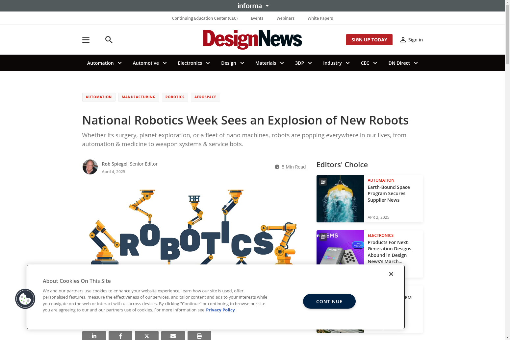
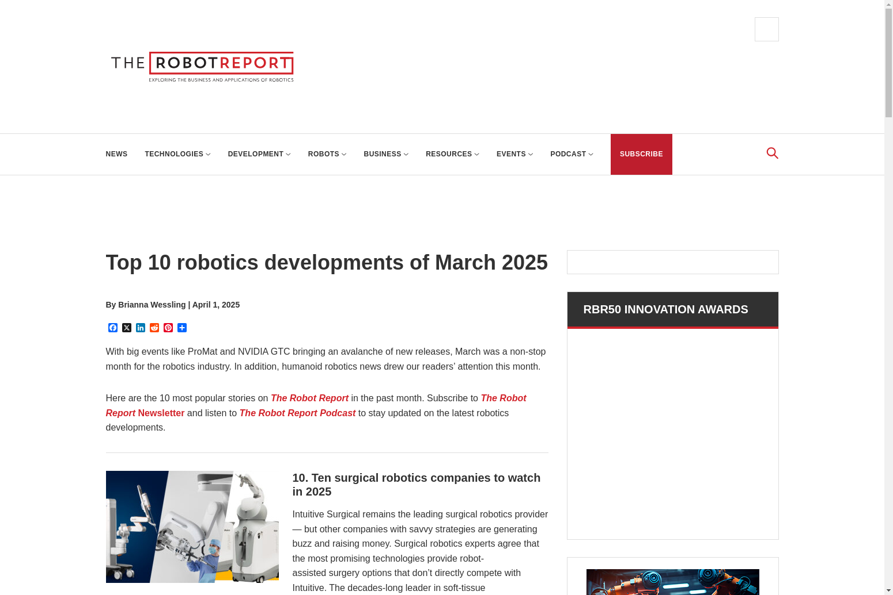
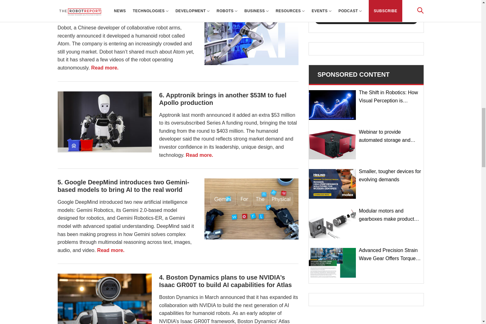
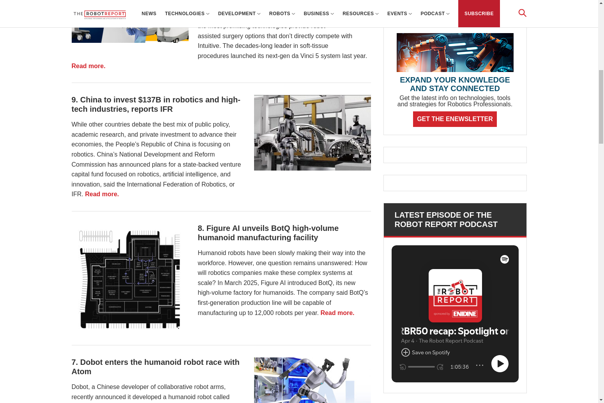
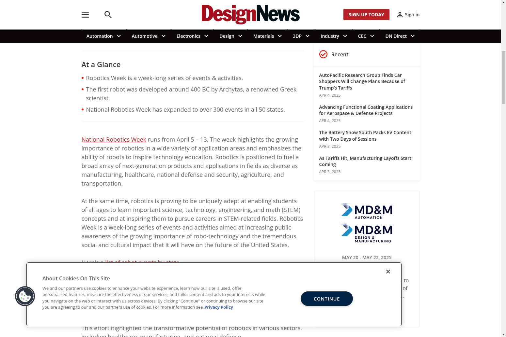
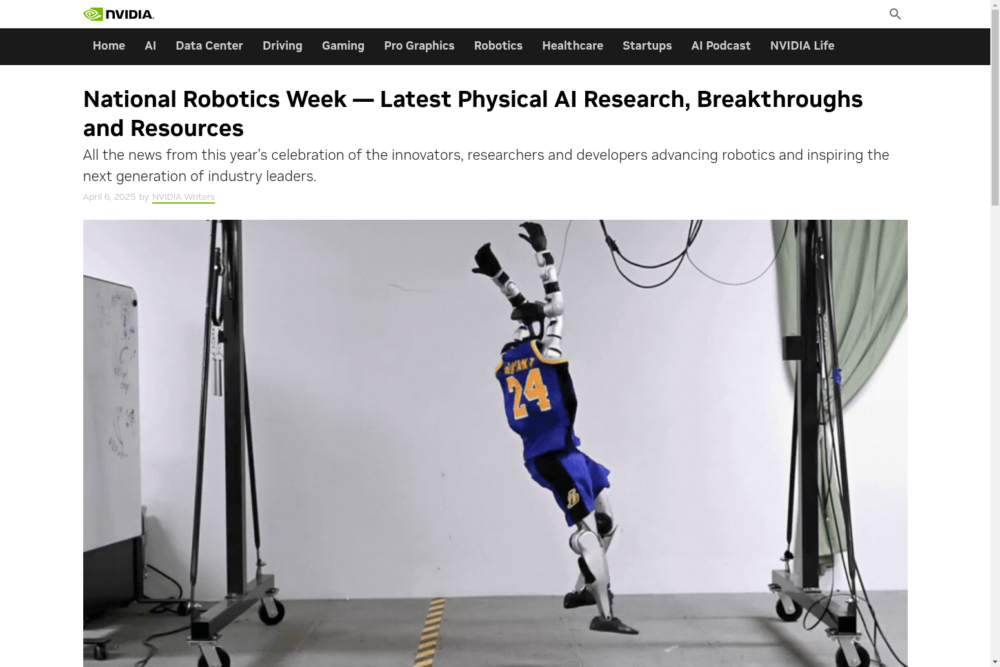

# 🤖 ROBOTICS NEWS DIGEST
## *March-April 2025 Edition*

---

*Welcome to the latest edition of Robotics News Digest, your comprehensive source for the most significant developments in the robotics industry. This edition covers the transformative period of March-April 2025, featuring groundbreaking advancements in humanoid robotics, AI integration, and manufacturing capabilities.*

---

## 📋 IN THIS ISSUE

- [🔍 Introduction](#-introduction)
- [🏆 Top Robotics Developments](#-top-robotics-developments)
- [🎯 National Robotics Week Highlights](#-national-robotics-week-highlights)
- [🧠 Humanoid Robotics Revolution](#-humanoid-robotics-revolution)
- [⚡ AI & Robotics Integration](#-ai--robotics-integration)
- [💰 Investment & Market Trends](#-investment--market-trends)
- [🔮 Future Outlook](#-future-outlook)
- [📚 Resources & Further Reading](#-resources--further-reading)

---

## 🔍 INTRODUCTION

March and April 2025 have been transformative months for the robotics industry. Major events like ProMat and NVIDIA GTC brought an avalanche of new releases, while National Robotics Week (April 5-13) showcased the growing importance of robotics across various sectors. This period has seen unprecedented advancements in humanoid robotics, AI integration, and manufacturing capabilities that are reshaping the future of automation.

---

## 🏆 TOP ROBOTICS DEVELOPMENTS

According to The Robot Report, these were the most significant robotics developments in March 2025:

1. **[Boston Dynamics' Atlas Humanoid](https://www.therobotreport.com/behind-the-scenes-boston-dynamics-atlas-humanoid-learns-to-sequence-auto-parts/)**: Boston Dynamics released a new video of its electric Atlas humanoid robot, showing behind-the-scenes snippets of the robot learning to sequence auto parts.

2. **[RightHand Robotics Investment](https://www.therobotreport.com/righthand-robotics-receives-strategic-investment-from-rockwell-automation/)**: RightHand Robotics received a strategic investment from Rockwell Automation to enhance its piece-picking solutions for warehouse automation.

3. **[Singapore's RoboNexus](https://www.therobotreport.com/national-robotics-programme-launches-robonexus-to-help-singapore-startups/)**: Singapore's National Robotics Programme launched RoboNexus, a new initiative to accelerate robotics adoption across industries and public sectors.

4. **[Boston Dynamics and NVIDIA Collaboration](https://www.therobotreport.com/boston-dynamics-plans-to-use-nvidias-isaac-groot-to-build-ai-capabilities-for-atlas/)**: Boston Dynamics announced plans to use NVIDIA's Isaac GR00T framework to build the next generation of AI capabilities for humanoid robots.

5. **[Google DeepMind's Gemini Models](https://www.therobotreport.com/google-deepmind-introduces-two-gemini-based-models-to-bring-ai-to-the-real-world/)**: Google DeepMind introduced two new AI models for robotics: Gemini Robotics and Gemini Robotics-ER, designed to bring AI to the real world with advanced spatial understanding.

6. **[Apptronik's Apollo Funding](https://www.therobotreport.com/apptronik-brings-in-another-53m-to-fuel-apollo-production/)**: Apptronik secured an additional $53 million in funding, bringing its Series A total to $403 million for Apollo humanoid robot production.

   

7. **[Dobot's Atom Humanoid](https://www.therobotreport.com/dobot-enters-the-humanoid-robot-race-with-atom/)**: Dobot, a Chinese developer of collaborative robot arms, entered the humanoid robot race with Atom, showcasing its autonomous capabilities in a series of demonstration videos.

8. **[Figure AI's BotQ Facility](https://www.therobotreport.com/figure-ai-unveils-botq-high-volume-humanoid-manufacturing-facility/)**: Figure AI unveiled BotQ, a high-volume manufacturing facility for humanoids capable of producing up to 12,000 robots per year.

   

9. **[China's Robotics Investment](https://www.therobotreport.com/china-invests-137b-in-robotics-and-high-tech-industries-reports-ifr/)**: China announced plans to invest $137 billion in robotics and high-tech industries through a state-backed venture capital fund focused on innovation.

10. **[Surgical Robotics Companies](https://www.therobotreport.com/10-surgical-robotics-companies-to-watch-in-2025/)**: The report highlighted ten surgical robotics companies to watch in 2025, with Intuitive Surgical maintaining its leadership position while other companies develop complementary technologies.

---

## 🎯 NATIONAL ROBOTICS WEEK HIGHLIGHTS

[National Robotics Week 2025](https://www.therobotreport.com/national-robotics-week-2025-kicks-off-with-over-300-events/), running from April 5-13, highlighted the growing importance of robotics across various sectors:

- The week featured over [300 events across all 50 states](https://www.therobotreport.com/national-robotics-week-2025-kicks-off-with-over-300-events/), emphasizing robotics' role in technology education.
- Robotics is positioned to fuel next-generation products and applications in manufacturing, healthcare, national defense, agriculture, and transportation.
- The event aimed to inspire students to pursue careers in STEM-related fields and increase public awareness of robotics technology's social and cultural impact.
- Major companies including [NVIDIA](https://www.therobotreport.com/nvidia-highlights-physical-ai-research-for-national-robotics-week/), [Boston Dynamics](https://www.therobotreport.com/boston-dynamics-showcases-atlas-capabilities-at-national-robotics-week/), and [iRobot](https://www.therobotreport.com/irobot-launches-stem-initiatives-for-national-robotics-week/) hosted special demonstrations and educational workshops.

---

## 🧠 HUMANOID ROBOTICS REVOLUTION

Humanoid robotics saw significant progress during this period:

- **[Boston Dynamics' Atlas](https://www.therobotreport.com/behind-the-scenes-boston-dynamics-atlas-humanoid-learns-to-sequence-auto-parts/)**: The company's electric Atlas humanoid demonstrated advanced capabilities in auto parts sequencing and is being enhanced with NVIDIA's Isaac GR00T framework for improved AI capabilities.

- **[Apptronik's Apollo](https://www.therobotreport.com/apptronik-brings-in-another-53m-to-fuel-apollo-production/)**: With $403 million in total funding, Apptronik is accelerating production of its Apollo humanoid robot, reflecting strong market demand and investor confidence in the technology.

- **[Figure AI's Manufacturing Facility](https://www.therobotreport.com/figure-ai-unveils-botq-high-volume-humanoid-manufacturing-facility/)**: Figure AI's BotQ facility represents a significant step toward mass production of humanoid robots, with capacity for 12,000 units annually, addressing the challenge of scaling complex robotic systems.

- **[Dobot's Atom](https://www.therobotreport.com/dobot-enters-the-humanoid-robot-race-with-atom/)**: Dobot's entry into the humanoid market demonstrates the growing competition and innovation in this space, particularly from Chinese manufacturers.

---

## ⚡ AI & ROBOTICS INTEGRATION

AI integration with robotics accelerated during this period:

- **[NVIDIA's Physical AI](https://www.therobotreport.com/nvidia-highlights-physical-ai-research-for-national-robotics-week/)**: During National Robotics Week, NVIDIA highlighted pioneering technologies shaping the future of intelligent machines, particularly in physical AI that enables machines to perceive, plan, and act with greater autonomy.

- **[Google DeepMind's Gemini Models](https://www.therobotreport.com/google-deepmind-introduces-two-gemini-based-models-to-bring-ai-to-the-real-world/)**: The introduction of Gemini Robotics and Gemini Robotics-ER represents significant progress in how AI solves complex problems through multimodal reasoning across text, images, audio, and video.

- **[Robot Foundation Models](https://www.therobotreport.com/nvidia-releases-isaac-groot-framework-for-robot-foundation-models/)**: The emergence of world foundation models is accelerating the evolution of AI-enabled robots capable of adapting to dynamic and complex scenarios.

- **[NVIDIA's Isaac GR00T](https://www.therobotreport.com/nvidia-releases-isaac-groot-framework-for-robot-foundation-models/)**: This framework is empowering researchers and developers to push the boundaries of robotics by providing tools for robot simulation, training, and synthetic data generation.

---

## 💰 INVESTMENT & MARKET TRENDS

The robotics industry saw substantial investment and market developments:

- **[China's $137B Investment](https://www.therobotreport.com/china-invests-137b-in-robotics-and-high-tech-industries-reports-ifr/)**: China's National Development and Reform Commission announced plans for a state-backed venture capital fund focused on robotics, artificial intelligence, and innovation.

- **[Apptronik's $403M Funding](https://www.therobotreport.com/apptronik-brings-in-another-53m-to-fuel-apollo-production/)**: The oversubscribed Series A funding round for Apptronik reflects strong market demand for humanoid robots and investor confidence in the technology.

- **[Surgical Robotics Market](https://www.therobotreport.com/10-surgical-robotics-companies-to-watch-in-2025/)**: The surgical robotics market continues to evolve, with Intuitive Surgical maintaining leadership while new companies develop complementary technologies.

- **[Manufacturing Scale](https://www.therobotreport.com/figure-ai-unveils-botq-high-volume-humanoid-manufacturing-facility/)**: Figure AI's BotQ facility demonstrates the industry's shift toward high-volume production of humanoid robots, addressing the challenge of manufacturing complex systems at scale.

---

## 🔮 FUTURE OUTLOOK

March and April 2025 have demonstrated the accelerating pace of innovation in the robotics industry, particularly in humanoid robotics and AI integration. With significant investments, new manufacturing capabilities, and expanding applications across various sectors, robotics is positioned to transform industries and create new opportunities for technological advancement.

National Robotics Week highlighted the growing importance of robotics education and public awareness, while major companies like Boston Dynamics, NVIDIA, Google DeepMind, and Figure AI continue to push the boundaries of what's possible in robotics technology.

---

## 📚 RESOURCES & FURTHER READING

- [The Robot Report: Top 10 robotics developments of March 2025](https://www.therobotreport.com/top-10-robotics-developments-of-march-2025/)
- [The Robot Report: National Robotics Week 2025 Kicks Off With Over 300 Events](https://www.therobotreport.com/national-robotics-week-2025-kicks-off-with-over-300-events/)
- [The Robot Report: NVIDIA Highlights Physical AI Research for National Robotics Week](https://www.therobotreport.com/nvidia-highlights-physical-ai-research-for-national-robotics-week/)
- [The Robot Report: Figure AI Unveils BotQ High-Volume Humanoid Manufacturing Facility](https://www.therobotreport.com/figure-ai-unveils-botq-high-volume-humanoid-manufacturing-facility/)
- [The Robot Report: Boston Dynamics Plans to Use NVIDIA's Isaac GR00T to Build AI Capabilities for Atlas](https://www.therobotreport.com/boston-dynamics-plans-to-use-nvidias-isaac-groot-to-build-ai-capabilities-for-atlas/)
- [The Robot Report: 10 Surgical Robotics Companies to Watch in 2025](https://www.therobotreport.com/10-surgical-robotics-companies-to-watch-in-2025/)

---

*This report was compiled by Devin for RoboNews. All images and content are copyright of their respective owners. For more information, visit [robonews.github.io](https://robonews.github.io)*
